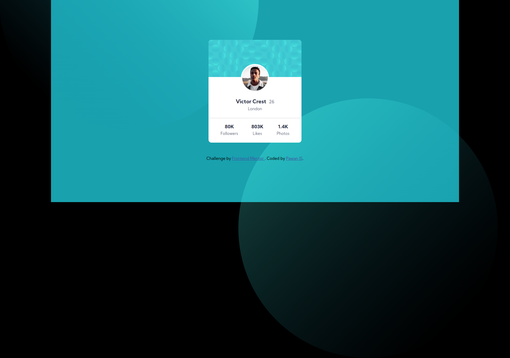

## A simple profile card made with HTML and CSS.

### This card is made as a challenge in frontend mentor which is a popular site of front-end challenges.

### Benefits of doing this challenge

1. Helps in improving skills in HTML and CSS.
2. You become familiar with how small components.
3. This can be used in future projects as well.
